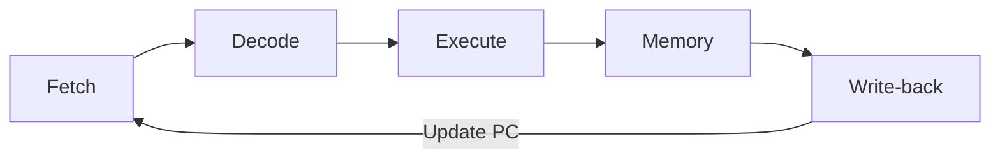
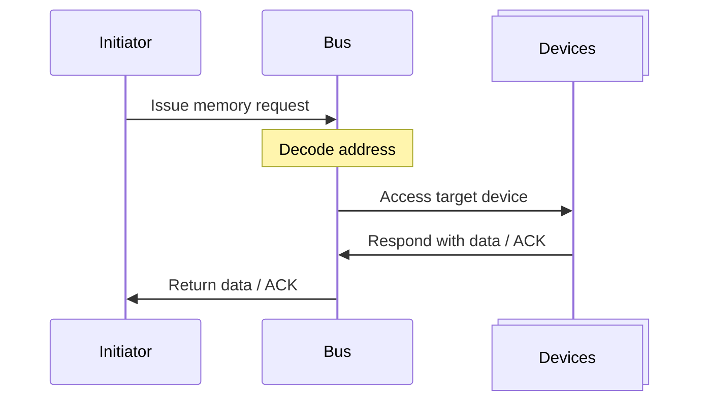
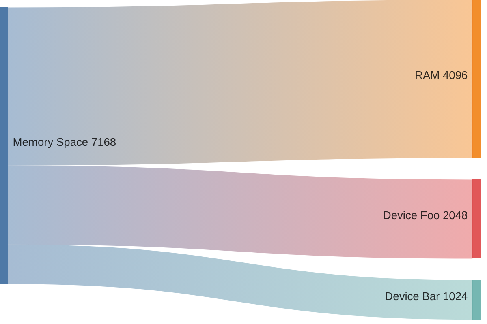
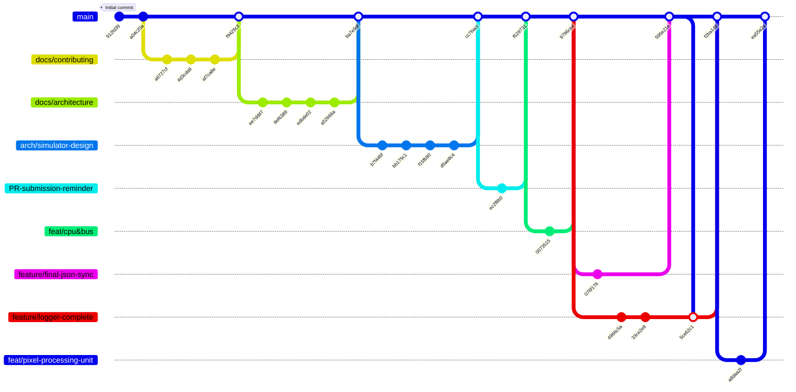

---
# try also 'default' to start simple
theme: purplin
# random image from a curated Unsplash collection by Anthony
# like them? see https://unsplash.com/collections/94734566/slidev
# background: https://cover.sli.dev
# some information about your slides (markdown enabled)
title: Y86-64 Simulator+
info: 
  ## Slidev Starter Template
  Presentation slides for developers.

  Learn more at [Sli.dev](https://sli.dev)
# apply UnoCSS classes to the current slide
# class: text-center
# https://sli.dev/features/drawing
drawings:
  persist: false
# slide transition: https://sli.dev/guide/animations.html#slide-transitions
transition: fade-out
# enable MDC Syntax: https://sli.dev/features/mdc
mdc: true
# duration of the presentation
duration: 5min
---

# Y86-64 Simulator+

Adiuvante Deo labor proficit.

<div class="abs-br m-6 text-xl">
  m0cal/Y86-64-Simulator-ICS-2025-Autumn
  <a href="https://github.com/m0cal/Y86-64-Simulator-ICS-2025-Autumn" target="_blank" class="slidev-icon-btn">
    <carbon:logo-github />
  </a>
</div>

<!--
The last comment block of each slide will be treated as slide notes. It will be visible and editable in Presenter Mode along with the slide. [Read more in the docs](https://sli.dev/guide/syntax.html#notes)
-->

---
transition: slide-up
---

# Members

And their contributions.

<br>
<div class="grid grid-cols-3 mt-5 text-center">
  <div class="space-y-4">
     
    <div class="text-xl font-sans tracking-wide">李睿洋</div>
    <div class="text-sm tracking-wide text-gray">Simulator Architecture & CPU</div>
    <div>
      <carbon:logo-github /> m0cal
    </div>
  </div>
  <div class="space-y-4">
    
    <div class="text-xl font-sans tracking-wide">夏温祺</div>
    <div class="text-sm tracking-wide text-gray">Status Snapshot & Structured Output</div>
    <div>
      <carbon:logo-github /> imnotvicx
    </div>
  </div>
  <div class="space-y-4">
    
    <div class="text-xl font-sans tracking-wide">韩穆如</div>
    <div class="text-sm tracking-wide text-gray">Program Parsing & Bus</div>
    <div>
      <carbon:logo-github /> hanmuru
    </div>
  </div>
</div>


<!--
You can have `style` tag in markdown to override the style for the current page.
Learn more: https://sli.dev/features/slide-scope-style
-->
<!--
<style>
h1 {
  background-color: #2B90B6;
  background-image: linear-gradient(45deg, #4EC5D4 10%, #146b8c 20%);
  background-size: 100%;
  -webkit-background-clip: text;
  -moz-background-clip: text;
  -webkit-text-fill-color: transparent;
  -moz-text-fill-color: transparent;
}
</style>
-->
<!--
Here is another comment.
-->

---
layout: two-cols-header
transition: fade
---

# SEQ CPU
An objective implementation.
<div class="text-center">

</div>
::left::
<div>
<div>
In standard design, a CPU clock cycle is conceptually divided into five stages: Fetch, Decode, Execute, Memory, and Write-back.
</div>
<p/>
<div v-click>
Status Codes, Registers and Condition Codes must be saved in `CPU` class for inter-cycle consistency.
</div>
<p/>
<div v-click="3">
But what should be saved in a single cycle as they are used within a single cycle, across stages?
</div>
</div>

::right::
````md magic-move{at:2, lines: true}

```cpp
void CPU::run_cycle() {
    fetch();
    decode();
    execute();
    memory();
    write_back();
    update_pc();
}
```

```cpp
void CPU::run_cycle() {
    if (stat_ != Y86Stat::AOK) {
        return;
    }
    fetch();
    decode();
    execute();
    memory();
    write_back();
    update_pc();
}
```

```cpp
void CPU::run_cycle() {
    if (stat_ != Y86Stat::AOK) {
        return;
    }
    fetch();
    decode();
    execute();
    memory();
    write_back();
    update_pc();
}
```

```cpp{*|5|*}
void CPU::run_cycle() {
    if (stat_ != Y86Stat::AOK) {
        return;
    }
    stage_ = StageState{};
    stage_.inst_pc = pc_;
    fetch();
    decode();
    execute();
    memory();
    write_back();
    update_pc();
}
```
````


---
transition: fade
layout: two-cols
---

# SEQ CPU

Scope in a cycle.

The intermediate results in a single cycle are saved in struct `StageState`.

It captures all values and control results produced across all the stages, also indicates the furthest stage reached by the instruction.

For example:
<div>
```
mrmovq 0x8(%rbx), %rax  // 50 03 08 00 00 00 00 00 00 00
```
</div>
<div v-click="7">
That means, it encodes the progress of an instruction, at stage granularity, providing a unified representation for both SEQ and pipelined implementations.

In our SEQ design, all of the states are used in a same cycle.
</div>
::right::
<div>

````md magic-move{at: 1, lines: true}

```cpp
struct StageState {
	uint8_t icode = 0;
	uint8_t ifun = 0;
	uint8_t rA = static_cast<uint8_t>(Register::RNONE);
	uint8_t rB = static_cast<uint8_t>(Register::RNONE);
	uint64_t valC = 0;
	uint64_t valA = 0;
	uint64_t valB = 0;
	uint64_t valE = 0;
	uint64_t valM = 0;
	uint64_t valP = 0;
	uint64_t inst_pc = 0;
	bool cnd = true;
	bool fetch_ok = false;
	bool decode_ok = false;
	bool execute_ok = false;
	bool mem_ok = false;
};
```

```cpp
struct StageState {
	uint8_t icode = 5;
	uint8_t ifun = 0;
	uint8_t rA = static_cast<uint8_t>(Register::rax);
	uint8_t rB = static_cast<uint8_t>(Register::rbx);
	uint64_t valC = 8;
	uint64_t valA = 0;
	uint64_t valB = 0;
	uint64_t valE = 0;
	uint64_t valM = 0;
	uint64_t valP = 10;
	uint64_t inst_pc = 1;
	bool cnd = true;
	bool fetch_ok = true;
	bool decode_ok = false;
	bool execute_ok = false;
	bool mem_ok = false;
};
```
```cpp
struct StageState {
	uint8_t icode = 5;
	uint8_t ifun = 0;
	uint8_t rA = static_cast<uint8_t>(Register::rax);
	uint8_t rB = static_cast<uint8_t>(Register::rbx);
	uint64_t valC = 8;
	uint64_t valA = 0;
	uint64_t valB = 1024;
	uint64_t valE = 0;
	uint64_t valM = 0;
	uint64_t valP = 10;
	uint64_t inst_pc = 1;
	bool cnd = true;
	bool fetch_ok = true;
	bool decode_ok = true;
	bool execute_ok = false;
	bool mem_ok = false;
};
```
```cpp
struct StageState {
	uint8_t icode = 5;
	uint8_t ifun = 0;
	uint8_t rA = static_cast<uint8_t>(Register::rax);
	uint8_t rB = static_cast<uint8_t>(Register::rbx);
	uint64_t valC = 8;
	uint64_t valA = 0;
	uint64_t valB = 1024;
	uint64_t valE = 1032;
	uint64_t valM = 0;
	uint64_t valP = 10;
	uint64_t inst_pc = 1;
	bool cnd = true;
	bool fetch_ok = true;
	bool decode_ok = true;
	bool execute_ok = true;
	bool mem_ok = false;
};
```
```cpp
struct StageState {
	uint8_t icode = 5;
	uint8_t ifun = 0;
	uint8_t rA = static_cast<uint8_t>(Register::rax);
	uint8_t rB = static_cast<uint8_t>(Register::rbx);
	uint64_t valC = 8;
	uint64_t valA = 0;
	uint64_t valB = 1024;
	uint64_t valE = 1032;
	uint64_t valM = 0xABC;
	uint64_t valP = 10;
	uint64_t inst_pc = 1;
	bool cnd = true;
	bool fetch_ok = true;
	bool decode_ok = true;
	bool execute_ok = true;
	bool mem_ok = true;
};
```
````
</div>

<div>
````md magic-move{at: 1, lines: true}

```cpp{none|1|2|3|4|5|6}
    fetch();
    decode();
    execute();
    memory();
    write_back();
    update_pc();
```
````

</div>

<style>
  .two-cols{
    column-gap: 50px;
  }
</style>

---
transition: slide-left
layout: fact
---

# Bus Transaction Flow

<div class="grid text-center">

</div>
---
transition: slide-up
layout: two-cols
---

# Bus Transaction Flow

Vroom, Vroom, Vroom


<br>
<div class="grid text-center">

<br>
A mapping example.
</div>

::right::

| Address | Device |
| ------ | ------- |
| 0x0 ~ 0x1000 |   RAM  |
|0x2000 ~ 0x2001|   Joystick | 
|  0x3000 ~ 0x30C0 |   PPU  |
| 0x4000 ~ 0x4001|   Timer |

<br>

```cpp
void register_device(Device& d, uint64_t sa, uint64_t ea);
```
```cpp
bus.register_device(ram, 0, 0x1000);
bus.register_device(ppu, 0x3000, 0x30C0);
bus.register_device(joystick, 0x2000, 0x2001);
bus.register_device(timer, 0x4000, 0x4001);
```
```cpp
BusResult read(uint64_t addr) const;
BusResult write(uint64_t addr, uint8_t data);
```
---
layout: two-cols
---
# PPU

Spiritus ubi vult spirat. (Io. 3:8)

Attributes of display:

* 120 x 30
* two-color
* double-buffered

So the overall size of the buffer is：

$$
\frac{(120 \times 30)\times 2}{8} = 900 (bytes)
$$

For CPU, this buffer is invisible.

Instead of rendering graphics pixel by pixel, it only determines which **sprite** to draw, and where it should be placed.

::right::
| Address | Attributes for |
| ------- | ---- |
| 0x3000 ~ 0x300C  | Sprite 0 |
| 0x300C ~ 0x3018 | Sprite 1|
| ... | ... |
| 0x30B4 ~ 0x30C0 | Sprite 15|

<br>
```cpp
struct Sprite{
  uint64_t addr; // pointing to where the bitmap stored
  uint8_t height; // in px
  uint8_t width;
  uint8_t x;
  uint8_t y;
};

```


---
layout: default
---
# Git Graph


---
layout: end
---

# Q & A